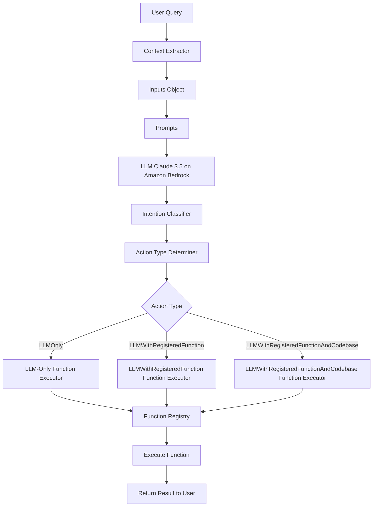

# Design Document: Intention Classification and Function Registry for GitHub Operations

## 1. Introduction

This document outlines the design for implementing the GitHub App which uses intention classification to interpret user queries and a agent-alike framework to execute appropriate actions. This design aims to create a modular, extensible, and efficient system capable of handling a wide range of GitHub-related tasks.

## 2. System Overview

The system consists of several key components:
1. Intention Classifier: Uses LLM to classify user intentions.
2. Action Type Determiner: Determines the appropriate action type based on the classified intention.
3. Function Registry: Manages the available functions for different action types.
4. Action Executor: Selects and executes the appropriate function(s) based on the action type and user query.
5. Large Language Model (LLM) & Prompt Templates: Interfaces with the Large Language Model for various tasks.

The system works as follows:


## 3. Query Categories

The system will handle various types of user queries related to GitHub operations, including but not limited to:

| Intention Category | Action |
|--------------------|--------|
| Code review and analysis | Invoke GitHub API to fetch specific commit/file details or load the whole codebase into memory, then use LLM or registered functions to apply thereon, set to action type LLMWithRegisteredFunctionAndCodebase |
| Repository management | Use GitHub API to fetch repository details or load the whole codebase into memory, then use LLM or registered functions to apply thereon, set to action type LLMWithRegisteredFunction |
| Documentation tasks | Use LLM to generate documentation according to a style guide, then use registered functions to apply them, set to action type LLMOnly |
| GitHub Actions and CI/CD operations | Use GitHub API to fetch workflow details, then use LLM or registered functions to apply thereon, set to action type LLMWithRegisteredFunction |
| Other (general query) | Use LLM to generate output, set to action type LLMOnly |

Sample queries:

- Code review and analysis:
-- I pushed a fix in commit <commit_id>, please review it.
-- Generate unit testing code for this file, or read src/utils.ts and generate unit testing code.

- Repository management:
-- Summarize stats about this repository and render them as a table. Additionally, render a pie chart showing the language distribution in the codebase.
-- Modularize this function.
-- Read the files in the src/scheduler package and generate a class diagram using mermaid and a README in the markdown format.

- Documentation tasks:
-- Generate a Pull Request description for this PR.

- GitHub Actions and CI/CD operations:
-- Create a GitHub Actions workflow to deploy this service to AWS Lambda.

## 4. Key Components

### 4.1 Intention Classifier

The Intention Classifier uses the LLM to interpret user queries and classify them into predefined categories:

```typescript
class IntentionClassifier {
  private llm: LargeLanguageModel;

  constructor(llm: LargeLanguageModel) {
    this.llm = llm;
  }

  async classify(query: string, context: any): Promise<string> {
    const inputs = new Inputs(context);
    const prompt = Prompts.renderIntentionClassificationPrompt(inputs);
    return this.llm.classify(prompt);
  }
}
```

### 4.2 Action Type Determiner

The Action Type Determiner maps classified intentions to appropriate action types:

```typescript
class ActionTypeDeterminer {
  determineActionType(intention: string): FunctionType {
    // Logic to map intention to action type
  }
}
```

We define three main action types:
1. LLMOnly, only LLM is needed to generate the output
2. LLMWithRegisteredFunction, LLM is needed together with registered functions, e.g. GitHub API calls
3. LLMWithRegisteredFunctionAndCodebase, LLM is needed together with registered functions and the whole codebase is loaded into memory

### 4.3 Function Registry

We implement the Function Registry to manage the registration and retrieval of functions:

```typescript
interface RegisteredFunction {
  id: string;
  name: string;
  description: string;
  type: FunctionType;
  execute: (query: string, context: any) => Promise<any>;
}

class FunctionRegistry {
  private functions: Map<string, RegisteredFunction> = new Map();

  registerFunction(func: RegisteredFunction): void { /* ... */ }
  getFunction(id: string): RegisteredFunction | undefined { /* ... */ }
  listFunctions(type?: FunctionType): RegisteredFunction[] { /* ... */ }
  updateFunction(id: string, updates: Partial<RegisteredFunction>): void { /* ... */ }
  deleteFunction(id: string): boolean { /* ... */ }
}
```


### 4.4 Action Executor

The Action Executor is responsible for:
(1) select proper function to execute based on specific user query per category; 
(2) orchestrate the workflow of possible multiple function execution along with LLM invocation; 
(3) error handling of function execution and iteration with feedback or error message; 
(4) evaluation on the output per iteration and judgement on the criterion the final output meets.

```typescript
class ActionExecutor {
  private registry: FunctionRegistry;
  private llm: LargeLanguageModel;

  constructor(registry: FunctionRegistry, llm: LargeLanguageModel) {
    this.registry = registry;
    this.llm = llm;
  }

  async execute(intention: string, query: string, context: any): Promise<ExecutionResult> {
    const actionType = this.determineActionType(intention);
    const functions = this.registry.listFunctions(actionType);
    const selectedFunction = await this.selectFunction(functions, query, context);
    
    let result: any;
    let iterations = 0;
    const maxIterations = 3;

    do {
      try {
        result = await this.executeFunction(selectedFunction, query, context);
        const evaluation = await this.evaluateOutput(result, query, context);
        
        if (evaluation.isSatisfactory) {
          return { success: true, result, iterations };
        } else if (iterations < maxIterations) {
          context = { ...context, previousResult: result, feedback: evaluation.feedback };
        } else {
          return { success: false, error: "Max iterations reached without satisfactory result" };
        }
      } catch (error) {
        const errorHandler = await this.determineErrorHandling(error, query, context);
        if (errorHandler.retry && iterations < maxIterations) {
          context = { ...context, error, errorFeedback: errorHandler.feedback };
        } else {
          return { success: false, error: errorHandler.message };
        }
      }
      iterations++;
    } while (iterations < maxIterations);
  }

  private async selectFunction(functions: RegisteredFunction[], query: string, context: any): Promise<RegisteredFunction> { /* ... */ }
  private async executeFunction(func: RegisteredFunction, query: string, context: any): Promise<any> { /* ... */ }
  private async evaluateOutput(result: any, query: string, context: any): Promise<{ isSatisfactory: boolean, feedback?: string }> { /* ... */ }
  private async determineErrorHandling(error: any, query: string, context: any): Promise<{ retry: boolean, feedback?: string, message: string }> { /* ... */ }
  private determineActionType(intention: string): FunctionType { /* ... */ }
}
```

### 4.5 Large Language Model (LLM) & Prompt Templates

We will use Claude 3.5 or a similar LLM through Amazon Bedrock for intention classification, and the LLM will be provided with context about GitHub operations and the user's query.

We will implement a modular prompt system with two main classes:

```typescript
class Inputs {
  // Properties to store various input parameters
  constructor(context: any) {
    // Initialize properties based on context
  }
  clone(): Inputs {
    // Return a deep copy of the inputs
  }
  render(template: string): string {
    // Replace placeholders in template with actual values
  }
}

class Prompts {
  static intentionClassificationPrompt = "..."; // Prompt template
  static renderIntentionClassificationPrompt(inputs: Inputs): string {
    return inputs.render(this.intentionClassificationPrompt);
  }
  // Other prompt methods...
}
```

## 5. Future Work
- Develop a versioning system for registered functions
- Implement function chaining for complex operations
- Implement parallel execution for independent actions in complex queries
- Create a visual workflow designer for complex action sequences
- Develop a plugin system for easy addition of new action handlers
