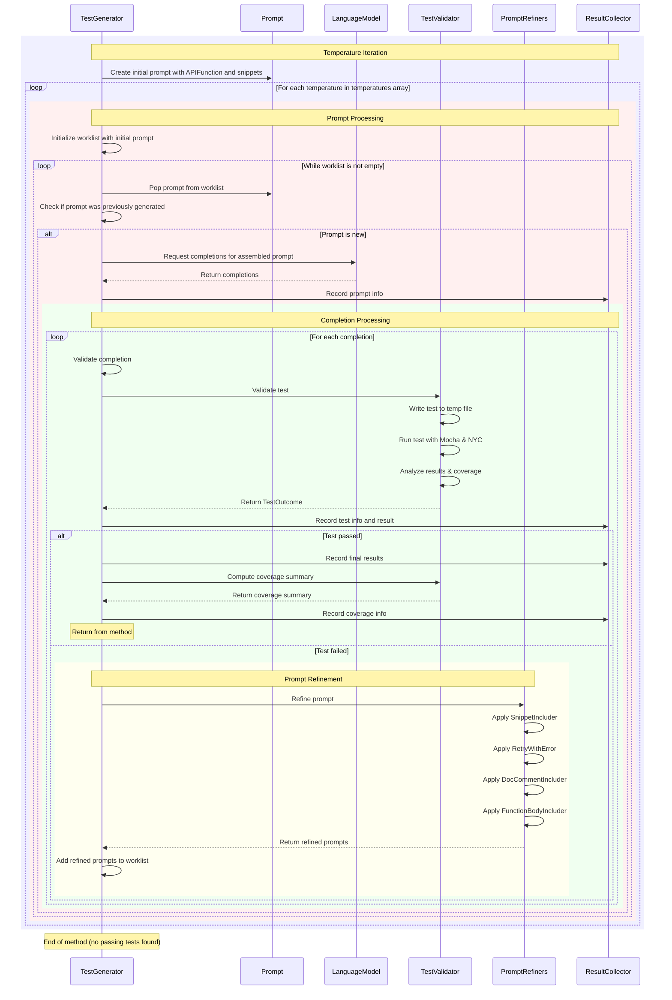

This is the detailed description of the workflow to generate unit test for a given code base using large language models.

## Components and Workflow
The core component includes:
- TestGenerator (TG): responsible for creating an initial prompt using the given APIFunction and snippets.
- Prompt (P): the prompt template used to generate the test cases.
- TestValidator (TV): responsible for validating the test cases generated by the TestGenerator.
- PromptRefiners (PR): responsible for refining the prompt if the test cases fail.
- ResultCollector (RC): responsible for collecting the results of the test generation process.

The workflow iterates through each temperature in the temperatures array.
1. The TestGenerator (TG) creates an initial Prompt (P) using the given APIFunction and snippets.
2. TG iterates through each temperature in the temperatures array.
3. For each temperature, TG initializes generatedPassingTests to false and creates a worklist with the initial prompt.
4. While the worklist is not empty:
    a. TG pops a prompt from the worklist.
    b. TG checks if the prompt was previously generated to avoid duplicates.
    c. If the prompt is new:
        -- TG requests completions from the LanguageModel (LM) using the assembled prompt.
        -- LM returns the completions.
        -- TG records prompt info in the ResultCollector (RC).
    d. For each completion:
        -- TG validates the completion by creating a test source.
        -- TG sends the test to the TestValidator (TV) for validation.
        -- TV writes the test to a temporary file, runs it with Mocha and NYC, and analyzes the results and coverage.
        -- TV returns the TestOutcome to TG.
        -- TG records the test info and result in RC.
        -- If the test passed, TG sets generatedPassingTests to true.
        -- If the test failed, TG uses PromptRefiners (PR) to generate refined prompts:
            -- PR applies SnippetIncluder, RetryWithError, DocCommentIncluder, and FunctionBodyIncluder.
            -- PR returns the refined prompts to TG.
            -- TG adds the refined prompts to the worklist.
5. After processing all completions, TG checks if generatedPassingTests is true. If so, it breaks the temperature loop.
6. After all temperatures have been processed or a passing test was generated, TG records the final results in RC.
7. TG requests a coverage summary from TV.
8. TV computes and returns the coverage summary.
9. TG records the coverage information in RC.

Mermaid template to elabrate the unit test generation process:


## API Provided

Start with then entry function below:
```typescript
export async function generateUnitTestsSuite(client: BedrockRuntimeClient, modelId: string, octokit: ReturnType<typeof getOctokit>, repo: { owner: string, repo: string }, unitTestSourceFolder: string): Promise<void> {
  const pullRequest = context.payload.pull_request as PullRequest;
  const branchName = pullRequest.head.ref;
  let allTestCases: any[] = [];

  // Check if the "auto-unit-test-baseline" tag exists
  const { data: tags } = await octokit.rest.repos.listTags({
    ...repo,
    per_page: 100,
  });
  const baselineTagExists = tags.some(tag => tag.name === 'auto-unit-test-baseline');

  if (!baselineTagExists) {
    // Generate tests for all .ts files in the specified folder
    try {
      const { data: files } = await octokit.rest.repos.getContent({
        ...repo,
        path: unitTestSourceFolder,
      });

      if (Array.isArray(files)) {
        for (const file of files) {
          if (file.type === 'file') {
            const { data: content } = await octokit.rest.repos.getContent({
              ...repo,
              path: file.path,
            });
            if ('content' in content && typeof content.content === 'string') {
              const decodedContent = Buffer.from(content.content, 'base64').toString('utf8');
              // TODO, Core logic to generate test cases
              allTestCases = allTestCases.concat(testCases);
            }
          }
        }
      }
    } catch (error) {
      console.error('Failed to list files in the specified folder, make sure the folder is correct, error: ', error);
      return;
    }

    // Create the baseline tag (changed from "auto unit test baseline" to "auto-unit-test-baseline")
    try {
      await octokit.rest.git.createRef({
        ...repo,
        ref: 'refs/tags/auto-unit-test-baseline',
        sha: pullRequest.head.sha,
      });
      console.log('Tag created successfully');
      await setTimeout(5000); // Wait for 5 seconds
    } catch (error) {
      console.error('Failed to create tag:', error);
    }
  } else {
    // Generate tests only for files changed in the PR
    const { data: changedFiles } = await octokit.rest.pulls.listFiles({
      ...repo,
      pull_number: pullRequest.number,
    });

    for (const file of changedFiles) {
      if (file.filename.startsWith(unitTestSourceFolder)) {
        const { data: content } = await octokit.rest.repos.getContent({
          ...repo,
          path: file.filename,
          ref: pullRequest.head.sha,
        });
        if ('content' in content && typeof content.content === 'string') {
          const decodedContent = Buffer.from(content.content, 'base64').toString('utf8');
          // TODO, Core logic to generate test cases
          allTestCases = allTestCases.concat(testCases);
        }
      }
    }
  }

  if (allTestCases.length === 0) {
    console.warn('No test cases generated. Skipping unit tests execution and report generation.');
    return;
  }

  // Add the generated unit tests to existing PR
  if (pullRequest) {
    try {
      if (!branchName) {
        throw new Error('Unable to determine the branch name');
      }

      // Create a new file with the generated unit tests in test folder
      const unitTestsContent = allTestCases.map(tc => tc.code).join('\n\n');
      const unitTestsFileName = 'test/unit_tests.ts';

      // Check if the file already exists
      let fileSha: string | undefined;
      try {
        const { data: existingFile } = await octokit.rest.repos.getContent({
          ...repo,
          path: unitTestsFileName,
          ref: branchName,
        });
        if ('sha' in existingFile) {
          fileSha = existingFile.sha;
        }
      } catch (error) {
        // File doesn't exist, which is fine for the first time
        console.log(`File ${unitTestsFileName} does not exist in the repository. Creating it.`);
      }

      await octokit.rest.repos.createOrUpdateFileContents({
        ...repo,
        path: unitTestsFileName,
        message: 'Add or update generated unit tests',
        content: Buffer.from(unitTestsContent).toString('base64'),
        branch: branchName,
        sha: fileSha, // Include the sha if the file exists, undefined otherwise
      });

      console.log(`Unit tests file ${unitTestsFileName} created or updated successfully.`);

    } catch (error) {
      console.error('Error occurred while pushing the changes to the PR branch', error);
      throw error;
    }
  }
}
```

## Detailed Explanation

Question: How to initialize the temperature array?
Answer: The temperature array is initialized in the constructor of the TestGenerator class:
```typescript
constructor(
    private temperatures: number[],
    private snippetMap: SnippetMap,
    private model: ICompletionModel,
    private validator: TestValidator,
    private collector: ITestResultCollector
) {}
```

The temperatures array is passed as a parameter when creating a TestGenerator instance. It's typically set up with a range of values, for example:
```typescript
const temperatures = [0.2, 0.5, 0.8, 1.0];
const testGenerator = new TestGenerator(temperatures, ...);
```

Question: How to validate the completion?
Answer: The completion is validated in the validateCompletion method of the TestGenerator class. It does more than just verifying if the generated test case can execute and pass. Here's the process:
a. It creates a complete test source using the prompt and completion.
b. It records the test info using the collector.
c. It checks if the test has been validated before.
d. If the completion is empty, it fails the test.
e. If the test source is valid, it uses the validator to run the test:
```typescript
outcome = this.validator.validateTest(
  testInfo.testName,
  testInfo.testSource
);
```
The MochaValidator class actually runs the test using Mocha and NYC for code coverage, checking if it passes, fails, or has other outcomes.

Question: What are the implementation of the MochaValidator class, specifically focusing on how it runs tests using Mocha and NYC for code coverage.
Answer: The MochaValidator class is implemented as follows:

1. Test File Preparation:
The validateTest method in MochaValidator first prepares the test file:
```typescript
let testFile = path.join(this.testDir, testName);
fs.writeFileSync(
  testFile,
  testSource.replace(requirePattern, `require('..')`)
);
```
This writes the test source to a temporary file, replacing the package require statement to use a relative path.

2. Setting up Temporary Directories:
```typescript
const tmpDir = fs.mkdtempSync(path.join(os.tmpdir(), "mocha-validator"));
const coverageDir = path.join(tmpDir, "coverage");
const coverageReport = path.join(coverageDir, "coverage-final.json");
const reportFile = path.join(tmpDir, "report.json");
```
These lines set up temporary directories for storing Mocha and NYC output.

3. Running the Test:
The test is run using Node's spawnSync function, which executes Mocha and NYC in a child process:
```typescript
const res = spawnSync(
  path.join(__dirname, "..", "node_modules", ".bin", "nyc"),
  [
    `--cwd=${packagePath}`,
    `--exclude=${path.basename(this.testDir)}`,
    "--reporter=json",
    `--report-dir=${coverageDir}`,
    `--temp-dir=${coverageDir}`,
    path.join(__dirname, "..", "node_modules", ".bin", "mocha"),
    "--full-trace",
    "--exit",
    "--allow-uncaught=false",
    "--reporter=json",
    "--reporter-option",
    `output=${reportFile}`,
    "--",
    testFile,
  ],
  { timeout: 5000, killSignal: "SIGKILL" }
);
```
This command runs NYC (for code coverage) which in turn runs Mocha (for test execution).

4. Parsing the Results:
After the test run, the validator parses the results:
```typescript
const stderr = res.stderr.toString();
const report = MochaValidator.tryParseReport(reportFile);
```
It reads the stderr output and tries to parse the JSON report generated by Mocha.

5. Determining Test Outcome:
The validator then determines the test outcome based on several factors:
```typescript
if (
  res.status != 0 ||
  stderr.includes("AssertionError") ||
  !report ||
  report.failures.length > 0
) {
  // Test failed
  // ... (code to construct failure info)
} else {
  // Test passed or is pending
  if (report.passes.length > 0) {
    outcome = TestOutcome.PASSED(coverageReport, coverageDir);
    this.coverageDirs.push(coverageDir);
  } else {
    outcome = TestOutcome.PENDING;
  }
}
```
It checks the process exit status, stderr output, and the parsed report to determine if the test passed, failed, or is pending.

6. Handling Coverage Data:
For passing tests, the coverage data is retained:
```typescript
if (report.passes.length > 0) {
  outcome = TestOutcome.PASSED(coverageReport, coverageDir);
  this.coverageDirs.push(coverageDir);
}
```
The coverage report and directory are stored for later aggregation.

7. Cleanup:
For non-passing tests, the coverage data is cleaned up:
```typescript
if (outcome.status != "PASSED") {
  fs.rmdirSync(coverageDir, { recursive: true });
}
```
This implementation allows the MochaValidator to execute tests in isolation, capture detailed test results and code coverage information, and determine the outcome of each test. The use of NYC alongside Mocha enables the collection of code coverage data, which is crucial for assessing the quality and completeness of the generated tests.

Question: What the refiner functions do?
Answer: The refiner functions do the following:
- SnippetIncluder: Adds usage snippets to the prompt if they weren't included before.
- RetryWithError: For failed tests, adds the error message to the prompt and tries again.
- DocCommentIncluder: Adds the function's doc comments to the prompt if they weren't included before.
- FunctionBodyIncluder: Includes the body of the function in the prompt if it wasn't included before.
These refiners are used to iteratively improve the prompts based on previous test outcomes.

Question: How to break the iteration loop?
Answer: The main iteration loop in generateAndValidateTests breaks under these conditions:
- When a passing test is generated (generatedPassingTests = true).
- When all temperatures have been tried.
- When the worklist of prompts is empty for a given temperature.
There's no explicit maximum time limit, but the process stops when it has exhausted all options or generated a passing test.

Question: Where test results and coverage info are stored:
Answer: Test results and coverage information are stored in the ITestResultCollector instance, which is passed to the TestGenerator constructor as collector. The BaseTestResultCollector class implements this interface and stores:
- Tests in a Map<string, ITestInfo>
- Prompts in a Map<Prompt, IPromptInfo>
- Coverage summary in a ICoverageSummary object
The collector records test info, test results, prompt info, and coverage info throughout the process:
```typescript
this.collector.recordTestInfo(...);
this.collector.recordTestResult(...);
this.collector.recordPromptInfo(...);
this.collector.recordCoverageInfo(...);
```
At the end of the process, all this information can be retrieved from the collector for reporting or further analysis.